# Design Document - Dinely Restaurant Operating System

## Overview

### System Purpose

Dinely is an enterprise-grade, multi-tenant SaaS platform that provides comprehensive restaurant management capabilities. The system addresses the operational complexity of modern restaurants by unifying point-of-sale, kitchen operations, inventory, customer engagement, online ordering, third-party integrations, and financial tracking into a single cohesive platform.

### Core Design Principles

**1. Offline-First Architecture**

Restaurants operate in environments where network reliability cannot be guaranteed. The system treats offline operation as the default state, with server connectivity as an enhancement rather than a requirement. All critical operations—order creation, payment processing (cash), and kitchen ticket generation—function without network access.

**2. Multi-Tenant Isolation**

Each restaurant tenant operates in complete isolation with dedicated database schemas, ensuring data security and enabling tenant-specific customization. Schema-per-tenant architecture provides strong isolation boundaries while maintaining operational simplicity.

**3. Real-Time Synchronization**

State changes propagate across all connected devices within sub-second latency using WebSocket connections. This enables coordinated operation across POS terminals, kitchen displays, captain tablets, and management dashboards.

**4. Audit-First Security**

All sensitive operations generate immutable audit records. The system assumes insider threats and implements approval workflows, session management, and exception reporting to detect and prevent theft.

### Key Technical Decisions

**Database Strategy**: Schema-per-tenant PostgreSQL with Prisma ORM provides strong isolation without the operational overhead of separate database instances. Each tenant gets a dedicated schema within a shared PostgreSQL cluster, enforced at the ORM level through automatic tenant_id filtering.

**Offline Storage**: IndexedDB provides client-side persistence with sufficient capacity (50MB+) for menu data, pending orders, and sync queues. The system uses Dexie.js as an IndexedDB wrapper for query capabilities and schema management.

**Conflict Resolution**: Last-write-wins with vector clocks for ordering and optimistic locking for inventory transactions. Table state conflicts are resolved by treating the most recent operation with a valid session as authoritative.

**Real-Time Layer**: Socket.IO provides bidirectional WebSocket communication with automatic fallback to long-polling. Rooms are scoped by tenant and outlet to prevent cross-tenant message leakage.

**Background Jobs**: Bull queue with Redis backend handles asynchronous tasks including WhatsApp messaging, payment reconciliation, stock deductions, and backup generation.

### Research Findings Summary

Modern multi-tenant SaaS systems on PostgreSQL typically choose between three isolation strategies: shared tables with tenant_id filtering, schema-per-tenant, or database-per-tenant. Schema-per-tenant provides the optimal balance—stronger isolation than row-level security (RLS) without the operational complexity of managing hundreds of database instances ([PlanetScale best practices](https://planetscale.com/blog/approaches-to-tenancy-in-postgres), [AWS guidance](https://docs.aws.amazon.com/prescriptive-guidance/latest/saas-multitenant-managed-postgresql/welcome.html)).

For offline-first systems, the standard pattern involves local persistence (IndexedDB), a sync queue tracking pending operations, and explicit conflict resolution strategies ([Offline-first architecture patterns](https://lobehub.com/skills/telum-ai-speck-offline-first-architecture)). Kitchen Display Systems in restaurant environments require instant order routing via WebSocket with station-based filtering and visual time-based priority indicators ([KDS architecture guide](https://orderingstack.com/blog/a-guide-to-kitchen-display-system-kds-in-restaurant)).

Vector clocks enable conflict detection in distributed systems by maintaining per-node event counters. When neither clock dominates, concurrent writes require conflict resolution policies such as last-write-wins or manual merge ([Vector clocks in distributed systems](https://www.designgurus.io/course-play/grokking-the-advanced-system-design-interview/doc/vector-clocks-and-conflicting-data)).

## Architecture

### System Context

```mermaid
graph TB
    subgraph "External Systems"
        ZOMATO[Zomato API]
        SWIGGY[Swiggy API]
        RAZORPAY[Razorpay Gateway]
        STRIPE[Stripe Gateway]
        TWILIO[Twilio WhatsApp API]
        FCM[Firebase Cloud Messaging]
    end
    
    subgraph "Dinely Platform"
        API[API Gateway/Load Balancer]
        
        subgraph "Application Layer"
            POS[POS Service]
            KDS[Kitchen Display Service]
            CAPTAIN[Captain App Service]
            QR[QR Menu Service]
            ONLINE[Online Store Service]
            AGG[Aggregator Hub]
            INV[Inventory Service]
            CRM[CRM Service]
            ANALYTICS[Analytics Service]
            WHATSAPP[WhatsApp Service]
            ACCOUNTING[Accounting Service]
        end
        
        subgraph "Data Layer"
            POSTGRES[(PostgreSQL<br/>Multi-Tenant)]
            REDIS[(Redis<br/>Cache & Jobs)]
            S3[(AWS S3<br/>Backups & Assets)]
        end
        
        subgraph "Real-Time Layer"
            SOCKETIO[Socket.IO Server]
        end
    end
    
    subgraph "Client Devices"
        POS_TERMINAL[POS Terminal<br/>React + IndexedDB]
        KDS_SCREEN[Kitchen Display<br/>React]
        TABLET[Captain Tablet<br/>React + IndexedDB]
        CUSTOMER_PHONE[Customer Phone<br/>QR Menu PWA]
        CUSTOMER_WEB[Customer Browser<br/>Online Store]
    end
    
    POS_TERMINAL <-->|WebSocket| SOCKETIO
    KDS_SCREEN <-->|WebSocket| SOCKETIO
    TABLET <-->|WebSocket| SOCKETIO
    CUSTOMER_PHONE -->|HTTPS| API
    CUSTOMER_WEB -->|HTTPS| API
    
    API --> POS
    API --> KDS
    API --> CAPTAIN
    API --> QR
    API --> ONLINE
    API --> AGG
    API --> INV
    API --> CRM
    API --> ANALYTICS
    API --> WHATSAPP
    API --> ACCOUNTING
    
    POS --> POSTGRES
    KDS --> POSTGRES
    CAPTAIN --> POSTGRES
    QR --> POSTGRES
    ONLINE --> POSTGRES
    AGG --> POSTGRES
    INV --> POSTGRES
    CRM --> POSTGRES
    ANALYTICS --> POSTGRES
    WHATSAPP --> POSTGRES
    ACCOUNTING --> POSTGRES
    
    POS --> REDIS
    ONLINE --> REDIS
    WHATSAPP --> REDIS
    AGG --> REDIS
    
    WHATSAPP --> TWILIO
    ONLINE --> RAZORPAY
    ONLINE --> STRIPE
    AGG --> ZOMATO
    AGG --> SWIGGY
    WHATSAPP --> FCM
    
    ANALYTICS --> S3
```




### Deployment Architecture

**Frontend**: React 18 applications bundled with Vite, deployed to Cloudflare Pages with CDN distribution. Service workers enable offline operation and asset caching.

**Backend**: Node.js Express services running in Docker containers on AWS ECS Fargate. Horizontal scaling behind Application Load Balancer with health check endpoints.

**Database**: Amazon RDS for PostgreSQL with Multi-AZ deployment. Read replicas for analytics workloads. Automated daily snapshots with 30-day retention.

**Cache/Queue**: Amazon ElastiCache for Redis in cluster mode. Separate node groups for caching and job queue workloads.

**Storage**: Amazon S3 with lifecycle policies transitioning backups to Glacier after 30 days. CloudFront CDN for menu images and assets.

**Monitoring**: CloudWatch for logs and metrics, Sentry for error tracking, Datadog for APM and distributed tracing.

### Data Flow Patterns

**Order Creation Flow (Online)**:
1. Customer submits order via Online Store
2. Payment intent created with Razorpay/Stripe
3. Payment captured webhook triggers order creation
4. Order record inserted into PostgreSQL with tenant_id
5. Socket.IO broadcasts order to POS terminals and KDS screens
6. Bull job queued for WhatsApp confirmation
7. Inventory service deducts stock based on recipe specifications

**Order Creation Flow (Offline POS)**:
1. User creates order in POS, stored in IndexedDB
2. KOT generated and printed locally
3. Order marked as pending sync
4. Network reconnects, sync engine detects pending orders
5. Orders uploaded via batched API call with vector clock timestamps
6. Server validates and persists orders
7. Confirmation broadcast to other devices via Socket.IO

**Table State Synchronization**:
1. Table status change (occupied, available) on any device
2. Socket.IO message sent to room: `tenant_{tenantId}_outlet_{outletId}`
3. All connected devices receive update via WebSocket
4. UI updates optimistically with local state
5. Server persistence confirmed asynchronously


## Components and Interfaces

### POS Service

**Responsibilities**: Order management, table management, payment processing, invoice generation, cash drawer tracking.

**Key API Endpoints**:
```typescript
POST   /api/pos/orders                    // Create new order
GET    /api/pos/orders/:id                // Get order details
PATCH  /api/pos/orders/:id/items          // Add/remove items
POST   /api/pos/orders/:id/kot            // Generate KOT
POST   /api/pos/orders/:id/settle         // Process payment
POST   /api/pos/orders/:id/void           // Void order (requires manager approval)
GET    /api/pos/tables                    // List tables with status
PATCH  /api/pos/tables/:id/status         // Update table status
POST   /api/pos/cash-drawer/open          // Open cash drawer
POST   /api/pos/cash-drawer/close         // Close drawer with count
GET    /api/pos/invoices/next-number      // Get next invoice number
```

**Dependencies**: Inventory Service (stock deduction), CRM Service (customer lookup), Accounting Service (revenue recording).

**State Management**: Maintains order state machine with transitions: draft → submitted → preparing → ready → served → settled. Void and refund states accessible with manager approval.

### Kitchen Display Service

**Responsibilities**: Display incoming orders, route to kitchen stations, track preparation time, update order status.

**Key API Endpoints**:
```typescript
GET    /api/kds/orders                    // List active orders for station
PATCH  /api/kds/orders/:id/items/:itemId  // Mark item complete
POST   /api/kds/orders/:id/ready          // Mark entire order ready
GET    /api/kds/stations                  // List configured kitchen stations
```

**WebSocket Events**:
- `order:new` - New order arrived for station
- `order:update` - Order item status changed
- `order:priority` - Order marked as rush/priority

**Station Routing Logic**: Each menu item has a `stationId` property. Orders are broadcast to all stations, but each station filters to display only relevant items.


### Captain App Service

**Responsibilities**: Mobile order taking, offline operation, table assignment.

**Key API Endpoints**:
```typescript
POST   /api/captain/auth/pin              // Authenticate with PIN
GET    /api/captain/tables/assigned       // Get assigned tables
POST   /api/captain/orders                // Create order (with offline sync support)
POST   /api/captain/sync                  // Batch sync offline orders
GET    /api/captain/menu                  // Get menu for offline caching
```

**Offline Capabilities**: Full CRUD for orders stored in IndexedDB. Sync queue tracks create/update/delete operations with timestamps. Delta sync on reconnection using last_sync_timestamp.

### Aggregator Hub

**Responsibilities**: Third-party platform integration, order ingestion, status synchronization, payment reconciliation.

**Integration Architecture**:
```typescript
// Webhook handlers for each platform
POST   /api/aggregator/webhook/zomato
POST   /api/aggregator/webhook/swiggy
POST   /api/aggregator/webhook/talabat
POST   /api/aggregator/webhook/deliveroo

// Status update endpoints
POST   /api/aggregator/orders/:id/status  // Update external order status
GET    /api/aggregator/reconciliation     // Payment reconciliation report
```

**Order Transformation**: Each aggregator has a platform-specific parser that transforms external order format to internal schema. Parsed orders are injected into POS service with `source: 'aggregator'` metadata.

**Webhook Security**: HMAC signature verification for all incoming webhooks. Platform-specific signature algorithms (Zomato uses SHA256, Swiggy uses MD5).

### Inventory Service

**Responsibilities**: Stock tracking, recipe management, vendor management, purchase orders, automatic deductions.

**Key API Endpoints**:
```typescript
GET    /api/inventory/items               // List inventory items
POST   /api/inventory/items               // Create inventory item
PATCH  /api/inventory/items/:id/adjust    // Adjust stock (requires approval)
POST   /api/inventory/transactions        // Record stock transaction
GET    /api/inventory/recipes             // List recipes
POST   /api/inventory/recipes             // Create recipe specification
GET    /api/inventory/vendors             // List vendors
POST   /api/inventory/purchase-orders     // Create PO
POST   /api/inventory/purchase-orders/:id/receive  // Receive goods
```

**Automatic Deduction Logic**: When an order is settled, inventory service receives event via Bull job. For each order item with a recipe, deduct ingredient quantities. Use optimistic locking to prevent negative stock.


### CRM Service

**Responsibilities**: Customer profiles, purchase history, loyalty program, segmentation, feedback collection.

**Key API Endpoints**:
```typescript
GET    /api/crm/customers                 // List customers with filters
POST   /api/crm/customers                 // Create customer profile
GET    /api/crm/customers/:id             // Get customer details
GET    /api/crm/customers/:id/orders      // Get order history
POST   /api/crm/loyalty/award             // Award loyalty points
POST   /api/crm/loyalty/redeem            // Redeem points for discount
GET    /api/crm/segments                  // List customer segments
POST   /api/crm/feedback                  // Submit feedback
GET    /api/crm/feedback/pending          // Get pending feedback responses
```

**Loyalty Point Calculation**: Configurable earning rate (default 1 point per ₹100 spent). Points awarded after order settlement. Tier thresholds: Bronze (0), Silver (1000), Gold (5000), Platinum (10000).

**Duplicate Detection**: Phone number used as primary identifier. When creating a customer with existing phone, system flags potential duplicate for manual review.

### Analytics Service

**Responsibilities**: Dashboards, reports, KPI calculation, data export.

**Key API Endpoints**:
```typescript
GET    /api/analytics/dashboard           // Real-time dashboard metrics
GET    /api/analytics/reports/sales       // Sales report with date range
GET    /api/analytics/reports/menu-performance  // Menu item performance
GET    /api/analytics/reports/exceptions  // Exception report (voids, discounts)
POST   /api/analytics/reports/export      // Export to PDF/Excel
GET    /api/analytics/metrics/live        // Live metrics (refreshes every 60s)
```

**Metric Calculations**:
- **Food Cost %**: (Total ingredient cost / Total revenue) × 100
- **Labor Cost %**: (Total labor cost / Total revenue) × 100
- **Table Turnover**: Orders per table per day
- **Average Order Value**: Total revenue / Order count

**Report Generation**: Reports run against PostgreSQL read replicas to avoid impacting transactional workload. Large exports queued as Bull jobs.


### WhatsApp Service

**Responsibilities**: Transactional messaging, marketing campaigns, message queue management.

**Key API Endpoints**:
```typescript
POST   /api/whatsapp/send                 // Send single message
POST   /api/whatsapp/campaigns            // Create broadcast campaign
GET    /api/whatsapp/campaigns/:id/status // Get campaign delivery status
POST   /api/whatsapp/opt-out              // Customer opt-out
```

**Message Types**:
- **Transactional**: Order confirmation, order ready, payment receipt (no opt-out required)
- **Marketing**: Promotions, offers, announcements (requires opt-in)

**Queue Processing**: Bull queue with rate limiting (80 messages per second Twilio limit). Failed messages retry with exponential backoff (1s, 5s, 30s, 5m).

### Accounting Service

**Responsibilities**: Expense tracking, P&L reporting, GST calculation, Tally export, cash reconciliation.

**Key API Endpoints**:
```typescript
POST   /api/accounting/expenses           // Record expense
GET    /api/accounting/reports/pl         // Profit & Loss statement
GET    /api/accounting/reports/gst        // GST report (GSTR-1 format)
POST   /api/accounting/export/tally       // Export to Tally format
POST   /api/accounting/reconcile/cash     // Cash drawer reconciliation
```

**Revenue Recording**: Automatic journal entries created when orders are settled. Revenue categorized by stream (dine-in, delivery, online, aggregator).

**GST Calculation**: CGST and SGST calculated separately based on menu item category tax rates. Monthly GSTR-1 report generated from transaction logs.

### Sync Engine

**Responsibilities**: Conflict resolution, delta synchronization, vector clock management.

**Sync Protocol**:
```typescript
// Client sends pending operations
POST /api/sync {
  device_id: string,
  last_sync_timestamp: number,
  vector_clock: { [device_id]: number },
  operations: Array<{
    id: string,
    type: 'create' | 'update' | 'delete',
    entity: 'order' | 'table',
    data: object,
    timestamp: number,
    vector_clock: { [device_id]: number }
  }>
}

// Server responds with accepted ops and conflicts
Response {
  accepted: string[],        // Operation IDs successfully applied
  conflicts: Array<{
    operation_id: string,
    reason: string,
    server_state: object
  }>,
  delta: Array<object>,      // Changes since last_sync_timestamp
  vector_clock: { [device_id]: number }
}
```

**Conflict Resolution Strategy**:
- Orders: Last-write-wins based on vector clock
- Table status: Most recent valid session wins
- Inventory: Reject and require manual resolution


## Data Models

### Core Entities

```typescript
// Tenant - Root entity for multi-tenancy
interface Tenant {
  id: string;
  name: string;
  gstin: string;                    // GST identification number
  subscription_tier: 'starter' | 'professional' | 'enterprise';
  subscription_status: 'active' | 'suspended' | 'cancelled';
  created_at: Date;
  settings: {
    timezone: string;
    currency: string;
    loyalty_points_rate: number;    // Points per currency unit
  };
}

// Outlet - Physical restaurant location
interface Outlet {
  id: string;
  tenant_id: string;
  name: string;
  address: string;
  phone: string;
  email: string;
  is_active: boolean;
  settings: {
    service_charge_percent: number;
    tax_rates: { category: string; cgst: number; sgst: number; }[];
    table_prefix: string;
  };
}

// Menu Item
interface MenuItem {
  id: string;
  tenant_id: string;
  outlet_id: string | null;         // null = applies to all outlets
  name: string;
  description: string;
  category_id: string;
  price: number;
  image_url: string | null;
  is_available: boolean;
  tags: ('vegetarian' | 'vegan' | 'gluten-free' | 'spicy' | 'contains-nuts')[];
  station_id: string;               // Kitchen station for KDS routing
  preparation_time_minutes: number;
  created_at: Date;
  updated_at: Date;
}

// Menu Category
interface MenuCategory {
  id: string;
  tenant_id: string;
  name: string;
  display_order: number;
  tax_category: string;             // Links to tax rates in outlet settings
}

// Item Modifier
interface ItemModifier {
  id: string;
  tenant_id: string;
  name: string;                     // e.g., "Size", "Add-ons"
  type: 'single' | 'multiple';
  required: boolean;
  options: ModifierOption[];
}

interface ModifierOption {
  id: string;
  name: string;                     // e.g., "Large", "Extra Cheese"
  price_adjustment: number;         // Positive or negative
}
```


```typescript
// Order
interface Order {
  id: string;
  tenant_id: string;
  outlet_id: string;
  order_number: string;             // Human-readable: OUT1-2024-00123
  table_id: string | null;
  customer_id: string | null;
  source: 'pos' | 'captain' | 'qr' | 'online' | 'aggregator';
  aggregator_source: string | null; // 'zomato', 'swiggy', etc.
  type: 'dine-in' | 'takeaway' | 'delivery';
  status: 'draft' | 'submitted' | 'preparing' | 'ready' | 'served' | 'settled' | 'voided';
  items: OrderItem[];
  subtotal: number;
  tax_amount: number;
  tax_breakdown: { label: string; amount: number; }[];
  service_charge: number;
  discount_amount: number;
  discount_code: string | null;
  total: number;
  payment_method: 'cash' | 'card' | 'upi' | 'wallet' | 'online';
  payment_status: 'pending' | 'paid' | 'failed' | 'refunded';
  payment_transaction_id: string | null;
  created_by_user_id: string;
  created_at: Date;
  settled_at: Date | null;
  voided_at: Date | null;
  voided_by_user_id: string | null;
  voided_reason: string | null;
  vector_clock: { [device_id: string]: number };
  notes: string | null;
}

interface OrderItem {
  id: string;
  menu_item_id: string;
  menu_item_name: string;           // Denormalized for historical accuracy
  quantity: number;
  unit_price: number;
  modifiers: { name: string; option: string; price_adjustment: number; }[];
  special_instructions: string | null;
  status: 'pending' | 'preparing' | 'ready' | 'served';
  kot_printed_at: Date | null;
}

// Table
interface Table {
  id: string;
  tenant_id: string;
  outlet_id: string;
  number: string;                   // T1, T2, or custom like "VIP-1"
  capacity: number;
  status: 'available' | 'occupied' | 'reserved' | 'cleaning';
  current_order_id: string | null;
  occupied_at: Date | null;
  floor_plan_position: { x: number; y: number; shape: 'square' | 'round'; };
}

// Reservation
interface Reservation {
  id: string;
  tenant_id: string;
  outlet_id: string;
  table_id: string;
  customer_id: string;
  customer_name: string;
  customer_phone: string;
  party_size: number;
  reservation_date: Date;
  reservation_time: string;         // HH:mm format
  status: 'confirmed' | 'seated' | 'cancelled' | 'no-show';
  notes: string | null;
  created_at: Date;
}
```


```typescript
// Inventory Item
interface InventoryItem {
  id: string;
  tenant_id: string;
  outlet_id: string;
  name: string;
  category: string;                 // 'vegetables', 'meats', 'dairy', 'dry-goods'
  unit_of_measure: string;          // 'kg', 'liter', 'piece'
  current_quantity: number;
  minimum_threshold: number;        // Alert when below this
  reorder_quantity: number;
  weighted_average_cost: number;    // Updated on goods receipt
  last_updated_at: Date;
  version: number;                  // For optimistic locking
}

// Recipe Specification
interface Recipe {
  id: string;
  tenant_id: string;
  menu_item_id: string;
  version: number;
  effective_date: Date;
  ingredients: RecipeIngredient[];
  created_at: Date;
  is_active: boolean;
}

interface RecipeIngredient {
  inventory_item_id: string;
  inventory_item_name: string;
  quantity: number;
  unit_of_measure: string;
}

// Stock Transaction (Audit Trail)
interface StockTransaction {
  id: string;
  tenant_id: string;
  outlet_id: string;
  inventory_item_id: string;
  transaction_type: 'purchase' | 'adjustment' | 'deduction' | 'transfer' | 'waste';
  quantity_change: number;          // Positive or negative
  quantity_before: number;
  quantity_after: number;
  cost_per_unit: number | null;
  reason: string;
  reference_type: string | null;    // 'order', 'purchase_order', 'manual'
  reference_id: string | null;
  created_by_user_id: string;
  approved_by_user_id: string | null;
  created_at: Date;
}

// Vendor
interface Vendor {
  id: string;
  tenant_id: string;
  name: string;
  contact_person: string;
  phone: string;
  email: string;
  address: string;
  payment_terms: string;            // "Net 30", "COD", etc.
  gstin: string | null;
  is_active: boolean;
  created_at: Date;
}

// Purchase Order
interface PurchaseOrder {
  id: string;
  tenant_id: string;
  outlet_id: string;
  po_number: string;                // PO-2024-00045
  vendor_id: string;
  vendor_name: string;              // Denormalized
  status: 'draft' | 'sent' | 'received' | 'cancelled';
  line_items: POLineItem[];
  subtotal: number;
  tax_amount: number;
  total: number;
  created_by_user_id: string;
  created_at: Date;
  sent_at: Date | null;
  received_at: Date | null;
  notes: string | null;
}

interface POLineItem {
  inventory_item_id: string;
  inventory_item_name: string;
  quantity: number;
  unit_of_measure: string;
  unit_price: number;
  total_price: number;
}
```


```typescript
// Customer
interface Customer {
  id: string;
  tenant_id: string;
  name: string;
  phone: string;                    // Primary identifier (unique per tenant)
  email: string | null;
  address: string | null;
  date_of_birth: Date | null;
  loyalty_tier: 'bronze' | 'silver' | 'gold' | 'platinum';
  loyalty_points: number;
  lifetime_value: number;           // Total spend
  order_count: number;
  last_order_date: Date | null;
  tags: string[];                   // 'prefers-spicy', 'gluten-free', etc.
  whatsapp_opt_in: boolean;
  email_opt_in: boolean;
  created_at: Date;
  updated_at: Date;
}

// Loyalty Transaction
interface LoyaltyTransaction {
  id: string;
  tenant_id: string;
  customer_id: string;
  type: 'earn' | 'redeem' | 'expire' | 'adjustment';
  points: number;                   // Positive for earn, negative for redeem
  balance_before: number;
  balance_after: number;
  order_id: string | null;
  reason: string;
  created_at: Date;
}

// Feedback
interface Feedback {
  id: string;
  tenant_id: string;
  outlet_id: string;
  order_id: string;
  customer_id: string | null;
  food_quality_rating: number;      // 1-5
  service_speed_rating: number;     // 1-5
  overall_rating: number;           // 1-5
  comments: string | null;
  submitted_at: Date;
  response: string | null;
  responded_by_user_id: string | null;
  responded_at: Date | null;
  status: 'pending' | 'acknowledged' | 'resolved';
}

// User (Staff)
interface User {
  id: string;
  tenant_id: string;
  username: string;                 // Unique per tenant
  password_hash: string;
  pin_hash: string | null;          // For tablet quick login
  full_name: string;
  email: string;
  phone: string;
  role: 'admin' | 'manager' | 'cashier' | 'server' | 'kitchen';
  outlet_assignments: string[];     // Array of outlet IDs
  is_active: boolean;
  last_login_at: Date | null;
  created_at: Date;
}

// Role Permissions (hard-coded in application)
const ROLE_PERMISSIONS = {
  admin: ['*'],                     // All permissions
  manager: ['view_orders', 'create_orders', 'void_orders', 'access_reports', 
            'manage_inventory', 'approve_adjustments', 'manage_users'],
  cashier: ['view_orders', 'create_orders', 'process_payments', 'open_cash_drawer'],
  server: ['view_orders', 'create_orders', 'view_tables'],
  kitchen: ['view_orders', 'update_order_status', 'view_kds']
};
```


```typescript
// Audit Log (Immutable)
interface AuditLog {
  id: string;
  tenant_id: string;
  outlet_id: string;
  user_id: string;
  action: string;                   // 'void_order', 'apply_discount', 'adjust_inventory'
  entity_type: string;              // 'order', 'inventory_item'
  entity_id: string;
  before_state: object | null;
  after_state: object | null;
  ip_address: string;
  device_id: string;
  reason: string | null;
  approved_by_user_id: string | null;
  timestamp: Date;
}

// Cash Drawer Session
interface CashDrawerSession {
  id: string;
  tenant_id: string;
  outlet_id: string;
  opened_by_user_id: string;
  closed_by_user_id: string | null;
  opening_amount: number;
  expected_closing_amount: number;  // Opening + cash transactions
  actual_closing_amount: number | null;
  variance: number | null;          // Actual - Expected
  opened_at: Date;
  closed_at: Date | null;
  status: 'open' | 'closed';
}

// Discount Code
interface DiscountCode {
  id: string;
  tenant_id: string;
  code: string;                     // e.g., "WELCOME10"
  type: 'percentage' | 'fixed';
  value: number;
  min_order_value: number | null;
  max_discount: number | null;      // Cap for percentage discounts
  applicable_items: string[];       // Empty = all items
  valid_from: Date;
  valid_until: Date;
  usage_limit: number | null;       // null = unlimited
  usage_count: number;
  outlet_ids: string[];             // Empty = all outlets
  is_active: boolean;
  created_at: Date;
}

// Expense
interface Expense {
  id: string;
  tenant_id: string;
  outlet_id: string;
  category: 'food_cost' | 'labor' | 'rent' | 'utilities' | 'marketing' | 'other';
  amount: number;
  payment_method: 'cash' | 'card' | 'bank_transfer';
  vendor_name: string;
  description: string;
  receipt_url: string | null;
  expense_date: Date;
  recorded_by_user_id: string;
  created_at: Date;
}

// Device Registration (for offline sync)
interface Device {
  id: string;                       // UUID generated on device
  tenant_id: string;
  outlet_id: string;
  type: 'pos' | 'kds' | 'tablet';
  name: string;                     // "POS Terminal 1", "Kitchen Display 2"
  last_sync_at: Date;
  vector_clock: { [device_id: string]: number };
  is_active: boolean;
  registered_at: Date;
}
```


### Database Schema Design

**Multi-Tenant Isolation**: Each tenant gets a dedicated PostgreSQL schema. Schema naming convention: `tenant_{tenant_id}`. All queries automatically scoped by Prisma ORM using tenant context from JWT.

**Indexes**:
- `orders`: (tenant_id, outlet_id, created_at), (tenant_id, status), (tenant_id, order_number)
- `inventory_items`: (tenant_id, outlet_id, category), (tenant_id, outlet_id, current_quantity)
- `customers`: (tenant_id, phone), (tenant_id, email)
- `audit_log`: (tenant_id, timestamp), (tenant_id, entity_type, entity_id)

**Partitioning**: Orders and audit logs partitioned by month to manage table size. Automatic partition creation via cron job.

**Constraints**:
- Unique: (tenant_id, order_number), (tenant_id, username), (tenant_id, phone) on customers
- Check: current_quantity >= 0 on inventory_items
- Foreign keys enforce referential integrity within tenant schemas

### IndexedDB Schema (Client-Side)

```typescript
// Dexie.js schema definition
const db = new Dexie('DinelyOffline');
db.version(1).stores({
  menu_items: 'id, category_id, is_available',
  tables: 'id, status',
  orders: 'id, status, created_at',
  sync_queue: '++id, timestamp, type',
  settings: 'key'
});

// Sync Queue Entry
interface SyncQueueEntry {
  id?: number;                      // Auto-increment
  operation_id: string;             // UUID
  type: 'create_order' | 'update_order' | 'update_table';
  entity_type: string;
  entity_id: string;
  data: object;
  timestamp: number;
  vector_clock: { [device_id: string]: number };
  retry_count: number;
  status: 'pending' | 'syncing' | 'success' | 'failed';
}
```

**Storage Limits**: IndexedDB typically allows 50MB+ per origin. Menu data (~2MB), active orders (~5MB), sync queue (~10MB) leaves ample margin.

**Cache Invalidation**: Menu updates from server invalidate local cache via version number check. Stale data older than 24 hours automatically refreshed on app launch.


## Correctness Properties

*A property is a characteristic or behavior that should hold true across all valid executions of a system—essentially, a formal statement about what the system should do. Properties serve as the bridge between human-readable specifications and machine-verifiable correctness guarantees.*

### Property Reflection

After analyzing all acceptance criteria, the following properties were identified as testable via property-based testing. During reflection, several redundancies were eliminated:

**Combined Properties:**
- Properties 2.4 and 2.5 both test KOT completeness - combined into single property
- Audit logging properties (8.4, 12.6, 19.7) all verify transaction recording - can be tested as one general audit property
- GST calculation properties (2.6, 30.2) both verify tax breakdown - combined into comprehensive tax calculation property

**Unique Value Properties:**
Each remaining property provides distinct validation that cannot be subsumed by others.

### Property 1: Tenant Data Isolation

*For any* two different authenticated users from different tenants, API requests SHALL never return data belonging to the other tenant regardless of endpoint or query parameters.

**Validates: Requirements 1.2, 1.3, 1.5**

### Property 2: Order Calculation Correctness

*For any* order with items, modifiers, tax rates, service charges, and discounts, the total SHALL equal (sum of item prices with modifiers × quantities + service charge) × (1 + tax rate) - discount amount, and subtotal + tax + service charge - discount SHALL equal total.

**Validates: Requirements 2.3**

### Property 3: KOT Document Completeness

*For any* order submitted to the kitchen, the generated KOT SHALL include table number, all item names, quantities, selected modifiers, special instructions, and timestamp.

**Validates: Requirements 2.4, 2.5**

### Property 4: GST Compliance

*For any* order with GST-applicable items, the bill SHALL show CGST and SGST as separate line items where CGST = SGST = (applicable_rate / 2) × taxable_amount, and CGST + SGST SHALL equal total GST amount. The GSTIN SHALL appear on all bills and invoices.

**Validates: Requirements 2.6, 30.2, 30.6**


### Property 5: Order State Transition

*For any* order where payment is completed successfully, the order status SHALL transition to 'settled' and if the order has an associated table, the table status SHALL transition to 'available'.

**Validates: Requirements 2.8**

### Property 6: Invoice Number Sequential Integrity

*For all* orders settled within a tenant-outlet combination, invoice numbers SHALL form a gapless monotonically increasing sequence with no duplicates when sorted by settlement timestamp.

**Validates: Requirements 2.9**

### Property 7: Offline Sync Data Preservation

*For any* sequence of operations performed in offline mode (order creation, table status updates, KOT generation), when connectivity is restored, all operations SHALL be uploaded to the server with their original timestamps, user attribution, and data content preserved without loss.

**Validates: Requirements 3.5, 3.6, 19.4, 19.7**

### Property 8: Recipe-Based Inventory Deduction

*For any* menu item with a recipe specification, when the item is ordered with quantity Q, the inventory SHALL deduct (ingredient_quantity_in_recipe × Q) for each ingredient, and the deduction SHALL be recorded as a stock transaction with order reference.

**Validates: Requirements 8.2, 8.4**

### Property 9: Stock Alert Threshold

*For any* inventory item with a minimum threshold, when current quantity falls below the threshold after a transaction, the system SHALL emit a stock alert notification.

**Validates: Requirements 8.3**

### Property 10: Weighted Average Cost Calculation

*For any* inventory item, when goods are received with quantity Q at unit cost C, the new weighted average cost SHALL equal (previous_quantity × previous_WAC + Q × C) / (previous_quantity + Q), and the new quantity SHALL equal previous_quantity + Q.

**Validates: Requirements 8.6, 8.7**

### Property 11: Loyalty Points Accumulation

*For any* order with a settled amount A and configured loyalty rate R, the customer SHALL earn ⌊A × R⌋ loyalty points, and a loyalty transaction record SHALL be created with the correct balance_before, balance_after, and order reference.

**Validates: Requirements 12.1, 12.6**


### Property 12: Loyalty Tier Assignment

*For any* customer with loyalty points P, the customer's tier SHALL be: Bronze if P < 1000, Silver if 1000 ≤ P < 5000, Gold if 5000 ≤ P < 10000, Platinum if P ≥ 10000.

**Validates: Requirements 12.2, 12.3**

### Property 13: Loyalty Points Redemption Validation

*For any* redemption request of R points by a customer with balance B, the redemption SHALL succeed if R ≤ B (and balance updated to B - R with transaction record), and SHALL fail if R > B with balance unchanged.

**Validates: Requirements 12.4, 12.5, 12.6**

### Property 14: Offline Operations Resilience

*For any* sequence of offline operations (creating orders, generating KOTs, processing cash payments) performed while in offline mode, all operations SHALL succeed and be stored locally, and SHALL be executable without server connectivity.

**Validates: Requirements 19.3**

### Property 15: Sync Conflict Resolution

*For any* concurrent modification of the same table on multiple devices while offline, when both devices reconnect and sync, the conflict SHALL be resolved using vector clocks and the most recent operation with a valid session SHALL be applied, with no updates lost.

**Validates: Requirements 19.5, 20.5**

### Property 16: Delta Sync Completeness

*For any* device that disconnects at time T1 and reconnects at time T2, the delta sync SHALL deliver all updates that occurred on other devices between T1 and T2, and the device state SHALL converge to match the server state.

**Validates: Requirements 20.4**

### Property 17: Service Charge Line Item Separation

*For any* order with a configured service charge percentage S, the bill breakdown SHALL include a separate line item showing service_charge = subtotal × S, and the service charge SHALL be included in the taxable amount for GST calculation.

**Validates: Requirements 30.4**

### Property 18: Tax Rate Effective Dating

*For any* order created at timestamp T with a menu item in category C, the GST rate applied SHALL be the rate configured for category C with effective_date ≤ T, selecting the most recent effective rate.

**Validates: Requirements 30.5**


## Error Handling

### Error Categories and Strategies

**1. Validation Errors (4xx Client Errors)**

User input errors handled with descriptive messages and rollback:
- Invalid order data (missing required fields, negative quantities)
- Authentication failures (invalid PIN, expired session)
- Authorization failures (insufficient permissions for void/discount operations)
- Business rule violations (redeeming more points than available, adjusting stock without approval)
- Duplicate submissions (same order submitted twice)

Response format:
```typescript
{
  error: {
    code: 'VALIDATION_ERROR',
    message: 'Human-readable error message',
    field: 'specific_field_name',
    details: { /* additional context */ }
  }
}
```

**2. Infrastructure Errors (5xx Server Errors)**

System failures handled with retry logic and graceful degradation:
- Database connection failures: Exponential backoff retry (1s, 2s, 4s, 8s)
- Redis cache unavailability: Fallback to database queries (performance degradation but functional)
- S3 upload failures: Queue for retry, continue operation
- External API failures (payment gateways, WhatsApp): Queue for retry, mark as pending
- WebSocket disconnections: Automatic reconnection with exponential backoff

Response format:
```typescript
{
  error: {
    code: 'SERVICE_UNAVAILABLE',
    message: 'Service temporarily unavailable, please retry',
    retry_after: 30  // seconds
  }
}
```

**3. Business Logic Errors**

Domain-specific error conditions:
- Inventory stock insufficient: Reject order, suggest alternative items
- Payment processing failure: Mark order as payment_pending, send notification to staff
- Concurrent modification detected: Return conflict with current state, require user resolution
- Invoice number sequence exhausted: Lock, regenerate sequence, continue
- Cash drawer variance exceeds threshold: Require manager override


**4. Network Failures (Offline Handling)**

Client-side network errors trigger offline mode:
- API request timeout: Queue operation in IndexedDB sync queue
- WebSocket disconnection: Switch to polling fallback, attempt reconnection
- Partial response received: Retry with idempotency key
- DNS resolution failure: Enter offline mode immediately

Offline mode indicators:
- Visual banner in UI: "You are offline - orders will sync when reconnected"
- Icon in navigation bar showing connection status
- Local-only operations permitted: order creation, KOT generation, cash payments
- Blocked operations: online payment processing, report generation, menu publishing

**5. Data Integrity Errors**

Critical errors requiring immediate attention:
- Tenant isolation violation: Log to security audit, reject request, alert platform operator
- Audit log write failure: Halt operation, cannot proceed without audit record
- Optimistic lock version mismatch on inventory: Reject transaction, require retry with fresh data
- Referential integrity violation: Rollback transaction, log error for investigation
- Data type coercion failure: Reject malformed input, return validation error

### Error Monitoring and Alerting

**Sentry Integration**: All exceptions captured with context (tenant_id, user_id, request_id, stack trace)

**Alert Thresholds**:
- Error rate > 1% of requests: Alert on-call engineer
- Database connection pool exhaustion: Page immediately
- Payment gateway failures > 5 in 10 minutes: Alert finance team
- Sync failures > 10% of devices: Alert engineering team
- Security violations (cross-tenant access attempts): Alert security team immediately

**Error Recovery Logs**: All recovery attempts logged with outcome for post-incident analysis.

### Idempotency Guarantees

Operations that may be retried use idempotency keys:
- Order creation: `idempotency_key = device_id + timestamp + operation_id`
- Payment processing: Provided by payment gateway
- Stock adjustments: Transaction ID used as idempotency key
- KOT generation: Order ID + print timestamp combination ensures single print per order state

Idempotency keys stored with 24-hour TTL in Redis for deduplication.


## Testing Strategy

### Multi-Layered Testing Approach

The testing strategy combines property-based testing for business logic, example-based unit tests for specific scenarios, integration tests for external services, and end-to-end tests for critical workflows.

### 1. Property-Based Testing

**Framework**: fast-check (JavaScript/TypeScript property-based testing library)

**Configuration**: Minimum 100 iterations per property test (due to randomization across large input spaces)

**Property Test Implementation**:

Each correctness property from the design document SHALL be implemented as a property-based test with the following tag format in a comment:

```typescript
// Feature: dinely, Property 2: Order Calculation Correctness
it('calculates order totals correctly for all item combinations', () => {
  fc.assert(
    fc.property(
      orderArbitrary,  // Generator for random orders
      (order) => {
        const calculated = calculateOrderTotal(order);
        const expected = calculateExpectedTotal(order);
        expect(calculated.total).toBeCloseTo(expected.total, 2);
        expect(calculated.subtotal + calculated.tax + 
               calculated.serviceCharge - calculated.discount)
          .toBeCloseTo(calculated.total, 2);
      }
    ),
    { numRuns: 100 }
  );
});
```

**Custom Generators (Arbitraries)**:

The following custom generators will be created for domain entities:
- `orderArbitrary`: Generates orders with random items, quantities, modifiers, discounts
- `menuItemArbitrary`: Generates menu items with valid price ranges and configurations
- `inventoryItemArbitrary`: Generates inventory with random quantities and costs
- `recipeArbitrary`: Generates recipes with random ingredient lists
- `customerArbitrary`: Generates customers with random loyalty points and tiers
- `taxRateArbitrary`: Generates valid GST rates (0%, 5%, 12%, 18%, 28%)
- `offlineOperationSequenceArbitrary`: Generates sequences of offline operations

**Properties to Implement**:
- Property 1: Tenant Data Isolation (100 runs)
- Property 2: Order Calculation Correctness (100 runs)
- Property 3: KOT Document Completeness (100 runs)
- Property 4: GST Compliance (100 runs)
- Property 5: Order State Transition (100 runs)
- Property 6: Invoice Number Sequential Integrity (100 runs)
- Property 7: Offline Sync Data Preservation (100 runs)
- Property 8: Recipe-Based Inventory Deduction (100 runs)
- Property 9: Stock Alert Threshold (100 runs)
- Property 10: Weighted Average Cost Calculation (100 runs)
- Property 11: Loyalty Points Accumulation (100 runs)
- Property 12: Loyalty Tier Assignment (100 runs)
- Property 13: Loyalty Points Redemption Validation (100 runs)
- Property 14: Offline Operations Resilience (100 runs)
- Property 15: Sync Conflict Resolution (100 runs)
- Property 16: Delta Sync Completeness (100 runs)
- Property 17: Service Charge Line Item Separation (100 runs)
- Property 18: Tax Rate Effective Dating (100 runs)


### 2. Unit Testing

**Framework**: Jest with TypeScript support

**Focus Areas**:
- Specific edge cases not covered by property tests (empty carts, zero-value orders)
- Error handling paths (network failures, validation errors)
- Boundary conditions (maximum order size, minimum stock levels)
- State machine transitions with invalid states
- Authentication and authorization logic with specific user roles
- Date/time edge cases (timezone handling, midnight boundary, DST transitions)

**Example Unit Tests**:
```typescript
describe('Order Validation', () => {
  it('rejects empty cart', () => {
    expect(() => createOrder({ items: [] })).toThrow('Cart cannot be empty');
  });
  
  it('rejects negative quantities', () => {
    expect(() => addItem({ quantity: -1 })).toThrow('Quantity must be positive');
  });
  
  it('allows zero-priced items (promotions)', () => {
    const order = createOrder({ items: [{ price: 0, name: 'Free item' }] });
    expect(order.subtotal).toBe(0);
  });
});

describe('Role Permissions', () => {
  it('allows manager to void orders', () => {
    const user = { role: 'manager' };
    expect(canVoidOrder(user)).toBe(true);
  });
  
  it('prevents cashier from voiding orders', () => {
    const user = { role: 'cashier' };
    expect(canVoidOrder(user)).toBe(false);
  });
});
```

**Unit Test Coverage Goal**: 80% line coverage for business logic modules

### 3. Integration Testing

**Framework**: Jest with test containers for PostgreSQL and Redis

**External Service Mocking**:
- Razorpay/Stripe: Mock payment gateway responses using recorded fixtures
- Twilio WhatsApp: Mock API responses, verify request payloads
- Socket.IO: Use Socket.IO client in tests to verify broadcasts
- AWS S3: Use MinIO or LocalStack for local S3-compatible storage

**Integration Test Scenarios**:
```typescript
describe('Aggregator Integration', () => {
  it('ingests Zomato webhook and creates order', async () => {
    const webhookPayload = loadFixture('zomato_order.json');
    const signature = generateHMAC(webhookPayload, ZOMATO_SECRET);
    
    const response = await request(app)
      .post('/api/aggregator/webhook/zomato')
      .set('X-Zomato-Signature', signature)
      .send(webhookPayload);
    
    expect(response.status).toBe(200);
    const order = await db.order.findFirst({ 
      where: { aggregator_source: 'zomato' } 
    });
    expect(order).toBeDefined();
    expect(order.source).toBe('aggregator');
  });
});

describe('Offline Sync Flow', () => {
  it('syncs offline orders when reconnecting', async () => {
    const offlineOrders = generateOfflineOrders(5);
    const response = await request(app)
      .post('/api/captain/sync')
      .send({ operations: offlineOrders });
    
    expect(response.body.accepted).toHaveLength(5);
    expect(response.body.conflicts).toHaveLength(0);
  });
});
```


### 4. End-to-End Testing

**Framework**: Playwright for browser automation

**Critical User Flows**:
1. **Dine-in Order Flow**: Login → Select table → Add items → Generate KOT → Process payment → Verify invoice
2. **Online Order Flow**: Customer browses menu → Add to cart → Checkout → Payment → Order appears in POS and KDS
3. **Offline Resilience**: Create order offline → Disconnect network → Verify local storage → Reconnect → Verify sync
4. **Multi-Device Sync**: Update table status on device A → Verify update appears on device B within 500ms
5. **Aggregator Order**: Trigger Zomato webhook → Verify order in POS → Update status → Verify status update sent to Zomato

**E2E Test Environment**:
- Staging environment with isolated tenant database
- Seed data includes: 10 menu items, 5 tables, 2 users (cashier, manager)
- Reset database state before each test run
- Parallel execution with Playwright workers

### 5. Performance Testing

**Load Testing with Artillery**:
- Concurrent users: Simulate 50 concurrent POS terminals
- Order creation throughput: Target 100 orders/minute sustained
- WebSocket broadcast latency: Measure message delivery time
- Database query performance: Track slow queries (>100ms)
- Offline sync performance: Test syncing 100 offline orders

**Performance Benchmarks**:
- API response time p95 < 200ms
- WebSocket broadcast latency p95 < 500ms
- Order calculation < 10ms
- Invoice generation < 50ms
- Offline sync batch upload < 5 seconds for 100 orders

### 6. Security Testing

**Automated Security Checks**:
- Dependency scanning: npm audit and Snyk
- SQL injection: Parameterized queries enforced by ORM
- XSS prevention: Input sanitization and CSP headers
- CSRF protection: Token validation on state-changing operations
- Tenant isolation: Automated tests attempting cross-tenant access

**Manual Security Reviews**:
- Authentication flow audit (JWT validation, session management)
- Authorization matrix review (role-permission mappings)
- Audit log completeness review
- Payment flow security review (PCI-DSS compliance)

### Test Automation and CI/CD

**GitHub Actions Workflow**:
```yaml
on: [push, pull_request]
jobs:
  test:
    runs-on: ubuntu-latest
    steps:
      - uses: actions/checkout@v3
      - uses: actions/setup-node@v3
      - run: npm ci
      - run: npm run test:unit        # Unit + property tests
      - run: npm run test:integration # Integration tests with Docker
      - run: npm run test:e2e         # Playwright E2E tests
      - uses: codecov/codecov-action@v3
```

**Test Execution Strategy**:
- Unit tests: Run on every commit (fast feedback, ~2 minutes)
- Integration tests: Run on every commit (database required, ~5 minutes)
- E2E tests: Run on every PR (slower, ~10 minutes)
- Performance tests: Run nightly on staging environment
- Security scans: Run on every PR and nightly

**Test Data Management**:
- Factories using @faker-js/faker for generating test data
- Database fixtures for consistent integration test state
- Seed scripts for staging environment setup

---

**Design Document Complete**

This design provides a comprehensive technical blueprint for the Dinely Restaurant Operating System, covering architecture, components, data models, correctness properties, error handling, and testing strategy. The design emphasizes offline resilience, multi-tenant isolation, real-time synchronization, and property-based testing for business logic correctness.
